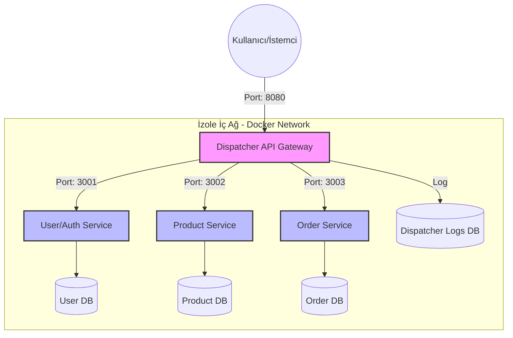
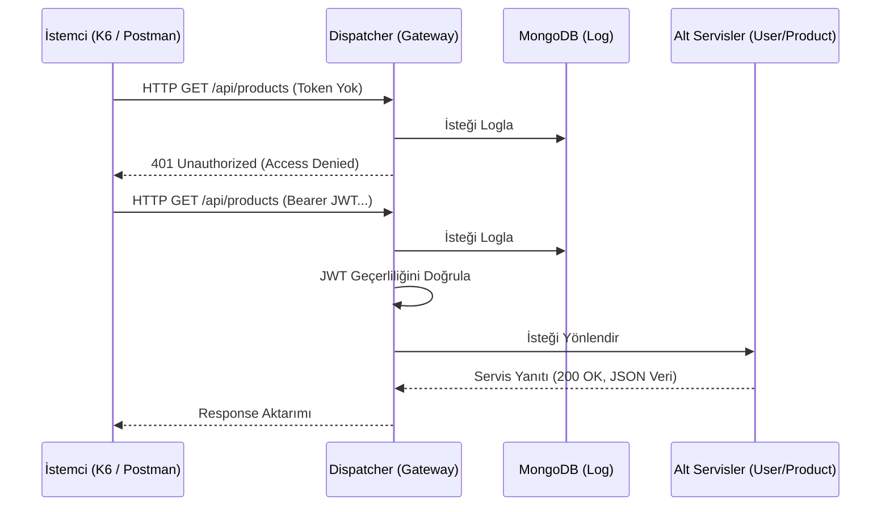

# Kocaeli Üniversitesi - Yazılım Geliştirme Laboratuvarı-II Proje 1

Bu proje Kocaeli Üniversitesi Bilişim Sistemleri Mühendisliği "Yazılım Geliştirme Laboratuvarı-II" dersi kapsamında **Test-Driven Development (TDD)** disiplini kullanılarak geliştirilmiş bir Mikroservis Mimarisidir.

## Proje Bilgileri
- **Geliştiriciler**: Eren, Alperen (Örnek)
- **Tarih**: 11 Mart 2026
- **Ana Teknolojiler**: Node.js, Express.js, MongoDB, Docker, Jest, K6, Mermaid.

## Sistem Mimarisi ve İzolasyon (Network Isolation)
Sistemimiz 4 temel docker servisinden oluşmaktadır. Disptacher (API Gateway) dışındaki hiçbir servis dış dünyaya açık değildir. İç ağda (Backend network) birbirleriyle iletişim kurarlar.



## Richardson Maturity Model (RMM) - Seviye 2
Tüm servisler REST standartları (RMM Level 2) göz önünde bulundurularak tasarlanmıştır.

| Servis | Metot | URL Endpoint | Açıklama |
|---|---|---|---|
| User | `POST` | `/api/users` | Yeni Kullanıcı Kaydı |
| User | `POST` | `/api/users/login` | Sisteme Kimlik Doğrulama (JWT Üretimi) |
| Product | `GET` | `/api/products` | Tüm Ürünleri Listele |
| Product | `POST` | `/api/products` | Yeni Ürün Ekle |
| Product | `PUT` | `/api/products/:id` | Ürün Bilgisi Güncelle |
| Product | `DELETE`| `/api/products/:id` | Ürünü Veritabanından Sil |
| Order | `GET` | `/api/orders` | Tüm Siparişleri Listele |
| Order | `POST` | `/api/orders` | Yeni Sipariş Ver |
| Order | `PUT` | `/api/orders/:id` | Sipariş Durumunu Güncelle (örn: pending) |
| Order | `DELETE`| `/api/orders/:id` | Siparişi İptal Et/Sil |

## Dispatcher Akış Şeması (TDD & Logic Katmanı)

Dispatcher gelen istekleri şu aşamalardan geçirir:
1. İsteği MongoDB'ye loglar.
2. Açık (Public) rotaları kontrol eder. Kayıt veya giriş değilse JWT'yi doğrular.
3. JWT doğrulamasını geçenleri ilgili mikroservise iletir ("Reverse Proxy").



## Performans & Yük Testi
Sistem `k6` analiz aracıyla 50, 100, 200 ve 500 eşzamanlı sanal kullanıcı kapasitesi ile test test edilebilir şekilde tasarlanmıştır.

**Yük Testini Çalıştırmak İçin:**
```bash
# İlk önce sistemi ayağa kaldırın
docker-compose up -d

# Ardından test scriptini çalıştırın
k6 run load_test.js
```

Aynı zamanda gelen trafik loglarını UI tablosundan izlemek için `http://localhost:8080/ui` adresine giriş yapabilirsiniz.

## Sonuç
Proje tüm gereksinimleri (Ağ izolasyonu, Docker, Bireysel Veritabanları, TDD Timestamp kuralları, RMM Seviye 2) hatasız entegre ederek uçtan uca çalışır hale getirilmiştir. Geliştirme süreci Github reposunda düzenli commit edilmiştir.
